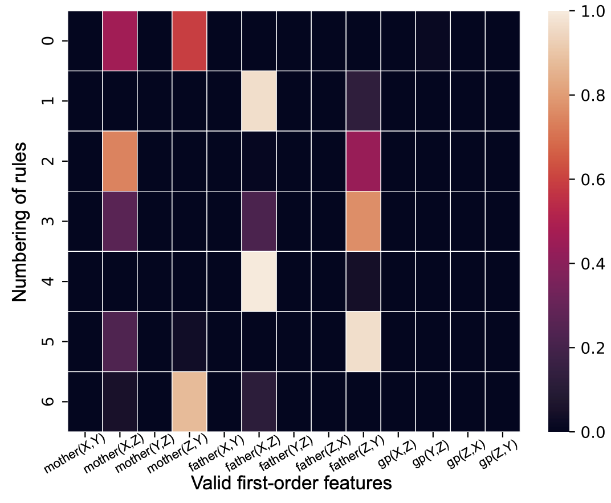

<!--  -->

|        |         |
| ------------ | --------- ---- | 
| | 📢 Bio: Researcher   📍 **Location: Singapore**    ✉️ Email: [kungao@pku.edu.cn](mailto:kungao@pku.edu.cn)   🔬 **Research topics: Differentiable Inductive Logic Programming; Foundation Models; Knowledge Graph; Time Series Data**   🔎 Find me: [[🎓 Google Scholar](https://scholar.google.co.uk/citations?user=9rKaxo0AAAAJ&hl=en&oi=sra)] [[🧳 LinkedIn](https://www.linkedin.com/in/kun-gao-298b7084/)] [[📝 CV](https://drive.google.com/file/d/1vWrppOp__upno6SBTBlU8uJG2gSwevu9/view?usp=sharing)] [[📆 Book an Appointment](https://calendly.com/gkings612/60min)]  | 

## Welcome

Hi, I am currently a scientist at [IHPC]( https://www.a-star.edu.sg/ihpc/ihpc-research-capabilities/computing-intelligence), [A*STAR](https://www.a-star.edu.sg/). I obtained my Ph.D. degree from School of Computer Science, Peking University. From Sept. 2019 to Mar. 2020, I was a visit student at National Institute of Informatics. My research interests focus on neuro-symbolic methods, differentiable inductive logic programming, time series processing, and foundation models. 

<!-- I am also open for a postdoc position. Please check out my research statememnt if you are interested. -->

## Education

- 2018.09 – 2023.07, Ph.D. Degree. Computer Science. [Peking University](https://english.pku.edu.cn), Beijing, China. Supervisor: Prof. Hanpin Wang, Prof. [Yongzhi Cao](https://scholar.google.com/citations?user=VEhLdikAAAAJ&hl=en)
- 2019.09 - 2020.03, Researcher Intern. [National Institute of Informatics](https://www.nii.ac.jp). Tokyo, Japan. Supervisor: Prof. [Katsumi Inoue](https://scholar.google.co.jp/citations?user=vei697QAAAAJ&hl=en)
- 2014.09 - 2018.07, Bachelor Degree. Information Security. [University of Science & Technology Beijing](https://en.ustb.edu.cn), Beijing, China

## Significant Publications 

|  |  [A differentiable first-order rule learner for inductive logic programming](https://www.sciencedirect.com/science/article/pii/S0004370224000444). **Gao, Kun**, Inoue, Katsumi, Cao, Yongzhi, & Wang, Hanpin (2024). **Artificial Intelligence**. ([Code](https://github.com/gaokun12/DFORL)) | 
|  |  [Learning First-Order Rules with Differentiable Logic Program Semantics](https://www.ijcai.org/proceedings/2022/417). **Gao, Kun**, Inoue, Katsumi, Cao, Yongzhi, & Wang, Hanpin (2022). **IJCAI-ECAI 2022**. (Long Oral Presentation, top 3.5%) ([Video](https://www.ijcai.org/proceedings/2022/video/417)) ([Code](https://github.com/gaokun12/DFORL)) ([Slide](slides/IJCAI_2022_DFOL.pdf)) | 
|  |  [Learning from interpretation transition using differentiable logic programming semantics](https://link.springer.com/article/10.1007/s10994-021-06058-8). **Gao, Kun**, Wang, Hanpin, Cao, Yongzhi, & Inoue, Katsumi (2022). **Machine Learning**. https://doi.org/10.1007/s10994-021-06058-8 ([Video](https://www.youtube.com/watch?v=M_65WZBkLAQ&t=89s)) ([Code](https://github.com/gaokun12/D-LFIT)) ([Slide](slides/D_LFIT_IJCLR.pdf)) | 

## Talks
- The 31st International Joint Conference on Artificial Intelligence and the 25th European Conference on Artificial Intelligence. (**IJCAI-ECAI 2022**). Learning First-Order Rules with Differentiable Logic Program Semantics. ([Video Link](https://www.ijcai.org/proceedings/2022/video/417))
- The 1st International Joint Conference on Learning & Reasoning (**IJCLR'21**). Learning from interpretation transition using differentiable logic programming semantics. ([Video Link](https://www.youtube.com/watch?v=M_65WZBkLAQ&t=89s))

## Work Experience
- 2023.08 - now, Scientist. **Institute of High Performance Computing**, **Agency for Science, Technology and Research**. Singapore.
 *Learning interpretable rules from real world data such as time series and image. Apply knowledge on symbolic rules on deep learning models. Using explainable AI methods on AI models to explain models’ predictions. Using large language models to perform rule induction tasks.*
- 2022.06 - 2022.09, Researcher Intern. **Microsoft Research Asia**. Beijing, China.
 *Perform the research on the interpretability of time-series data.*
- 2017.09 - 2018.03, Software Engineer Intern. **Intel**. Beijing, China.
 *Maintain the cloud computing opensource platform Nova and read papers about cloud storage systems.*

## Opensource Software
- [**DFOL**](https://github.com/gaokun12/DFORL): Learning first-order logic programs from relational datasets, including the knowledge graph and synthesis relational facts. Based on TensorFlow. Scalable, precise, robust, and <u>computation-cheap</u>. No GPU requirements.
- [**D-LFIT**](https://github.com/gaokun12/D-LFIT): Learning propositional logic programs from attribute-valued datasets, including cellular automata, table row data, etc. Based on TensorFlow. Precise, robust, fast, and <u>computation-cheap</u>. No GPU requirements.

## Peer Reviewer
- 2024, IEEE Transactions on Knowledge and Data Engineering
- 2024, ECAI

<!-- ## Skills
- TensorFlow, Python, PyTorch, C++, Java, HTML, JavaScript, SQL
- English, Chinese -->

<!-- ## Main Courses
- Deep Learning, Machine Learning, Algorithm and Complexity
- Linear Algebra, Assembly Language, Principles of Computer Organization
- Automata, Advanced Logic, Mathematical Foundation in Computer Science
- Academic Writing, Academic Research Methods -->

## Awards
- 2022.09, National Award (Peking University)
- 2022.09, Excellent Metric Student (Peking University)
- 2018.09, Excellent Graduated Student (USTB)
- 2017.09, People's Second Rank Award (USTB)
- 2016.09, People's Top Rank Award (USTB)

<!-- ## Find me

[**[🎓 Google Scholar](https://scholar.google.co.uk/citations?user=9rKaxo0AAAAJ&hl=en&oi=sra)**] [**[🧳 LinkedIn](https://www.linkedin.com/in/kun-gao-298b7084/)**] [**[📝 CV](https://drive.google.com/file/d/1vWrppOp__upno6SBTBlU8uJG2gSwevu9/view?usp=sharing)**] [**[📆 Book an Appointment](https://calendly.com/gkings612/60min)**] -->
<!-- [**[🐦 Twitter](https://twitter.com/kwin_gao)**]  -->
 <!-- [**[🐈‍⬛ GitHub](https://github.com/kwinHoney)**] -->
<!-- [**[📝 Blog](https://kwinhoney.github.io)**]   -->

 

