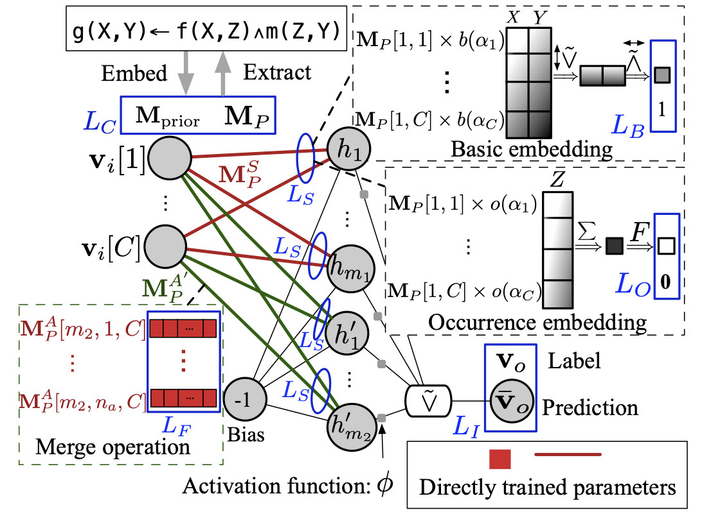
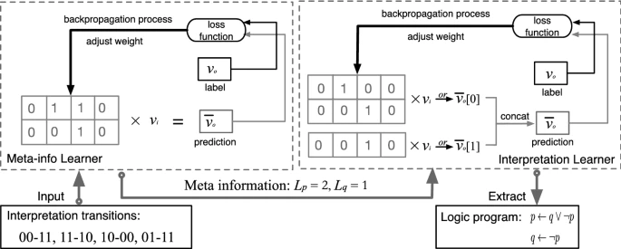

<!--  -->

|        |         |
| ------------ | --------- ---- | 
| | 📢 Bio: A Ph.D. student from School of CS, Peking University   📍 Location: Beijing, China    ✉️ Email: [kungao@pku.edu.cn](mailto:kungao@pku.edu.cn)  🔬 Research topics: Differentiable inductive logic programming; Machine Learning; Deep Learning; Knowledge Graph  | 

<!-- ## Kun Gao

Hi, I am a Ph.D. student from School of Computer Science, Peking University. My research interests focus on differentiable inductive logic programming, machine learning, and deep learning. -->

## Education

- 2018.09 - now, Ph.D. Candidate Student. Computer Science. **[Peking University](https://english.pku.edu.cn)**, Beijing, China. Supervisor: Prof. Hanpin Wang, Prof. [Yongzhi Cao](https://scholar.google.com/citations?user=VEhLdikAAAAJ&hl=en)
- 2019.09 - 2020.03, Researcher Intern. **[National Institute of Informatics](https://www.nii.ac.jp)**. Tokyo, Japan. Supervisor: Prof. [Katsumi Inoue](https://scholar.google.co.jp/citations?user=vei697QAAAAJ&hl=en)
- 2014.09 - 2018.07, Bechlor Degree. Information Security. **[University of Secience & Technology Beijing](https://en.ustb.edu.cn)**, Beijing, China

## Publications 

|        |         |
| ------------ | --------- ---- | 
| | 📍 **Gao, K.**, Inoue, K., Cao, Y., & Wang, H. (2022). [Learning First-Order Rules with Differentiable Logic Program Semantics](https://www.ijcai.org/proceedings/2022/417). **IJCAI-ECAI 2022**. (Long Oral Presentation, top 3.5%)  | 
| | **Gao, K.**, Wang, H., Cao, Y., & Inoue, K. (2022) [Learning from interpretation transition using differentiable logic programming semantics](https://link.springer.com/article/10.1007/s10994-021-06058-8). **Machine Learning**. https://doi.org/10.1007/s10994-021-06058-8  | 

- 📍 **Gao, K.**, Inoue, K., Cao, Y., & Wang, H. (2022). [Learning First-Order Rules with Differentiable Logic Program Semantics](https://www.ijcai.org/proceedings/2022/417). **IJCAI-ECAI 2022**. (Long Oral Presentation, top 3.5%) 
- **Gao, K.**, Wang, H., Cao, Y., & Inoue, K. (2022) [Learning from interpretation transition using differentiable logic programming semantics](https://link.springer.com/article/10.1007/s10994-021-06058-8). **Machine Learning**. https://doi.org/10.1007/s10994-021-06058-8

## Talks:
- The 31st International Joint Conference on Artificial Intelligence and the 25th European Conference on Artificial Intelligence. (**IJCAI-ECAI 2022**). Learning First-Order Rules with Differentiable Logic Program Semantics. ([Video Link](https://www.ijcai.org/proceedings/2022/video/417))
- The 1st International Joint Conference on Learning & Reasoning (**IJCLR'21**). Learning from interpretation transition using differentiable logic programming semantics. ([Video Link](https://www.youtube.com/watch?v=M_65WZBkLAQ&t=89s))

## Developed Softwares:
- **DFOL**: Learning first-order logic programs from relational datasets, including the knowledge graph and synthesis relational facts. Based on TenforFlow. Scalable, precise, robust, and computation-cheap. No GPU requirments.
- **D-LFIT**: Learning propositional logic programs from attribute-valued datasets, including cellular automata, table row data, etc. Based on TensorFlow. Precise, robust, fast, and computation-cheap. No GPU requirments.

## Skills

- TensorFlow, Python, PyTorch, C++, Java, HTML, JavaScript, SQL
- English, Chinese

## Main Courses
- Deep Learning, Machine Learning, Algorithm and Complexity
- Automata, Advanced Logic, Mathmatical Foundation in Computer Science
- Academic Writing, Academic Research Methods

## Work Experience
- 2022.06 - 2022.09, Researcher Intern. **Microsoft Research Asia**. Beijing, China. Perform the research on the interpretability of time-series data. 
- 2017.09 - 2018.03, Softeare Engineer Intern. **Intel**. Beijing, China. Maintain the cloud computing opensource plateform Nova and read papers about cloud storage systems.

## Awards
- 2022.09, National Award (Peking University)
- 2022.09, Excellent Metric Student (Peking University)
- 2018.09, Excellent Graduated Student (USTB)
- 2017.09, People's Second Rank Award (USTB)
- 2016.09, People's Top Rank Award (USTB)

## Find me

[**[🎓 Google Scholar](https://scholar.google.co.uk/citations?user=9rKaxo0AAAAJ&hl=en&oi=sra)**] [**[🧳 LinkedIn](https://www.linkedin.com/in/kun-gao-298b7084/)**]    
<!-- [**[🐦 Twitter](https://twitter.com/kwin_gao)**]  -->
 <!-- [**[🐈‍⬛ GitHub](https://github.com/kwinHoney)**] -->
<!-- [**[📝 Blog](https://kwinhoney.github.io)**]   -->

